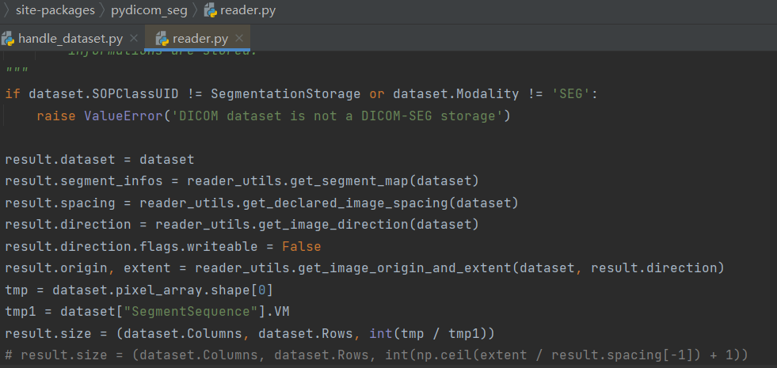

###LungCancer

#### handle_dataset.py 

1. 用于从数据集中提取CT序列和segmentation序列

2. 使用时需修改数据集路径

3. 默认将提取的数据保存到cts和segs两个文件夹下

4. 对于CT和segmentation shape不匹配的不保存

5. 相应运行结果保存在result.txt下

6. 由于在读取分割过程中发现pydicom_seg包对于shape的运算有误差，故**对pydicom_seg包中的reader.py文件进行了如下修改：**

   

####view_seg.py 

可以输出不为0的分割序列  通过输出图像查看对应的CT和分割是否匹配

